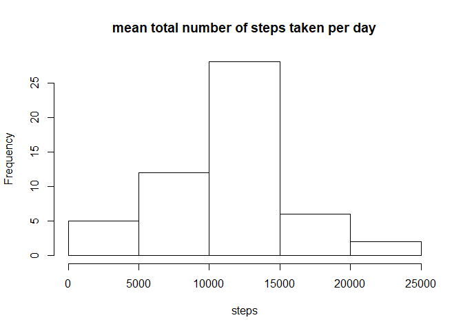
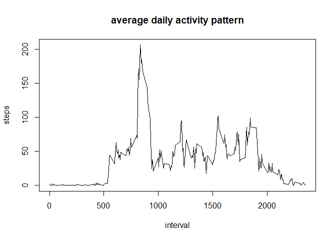
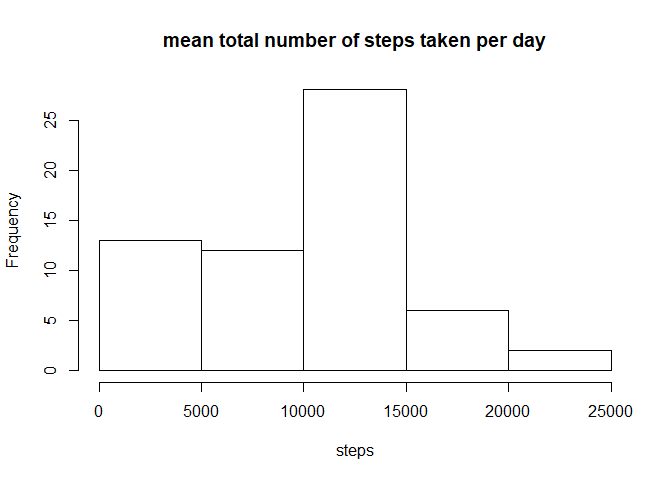
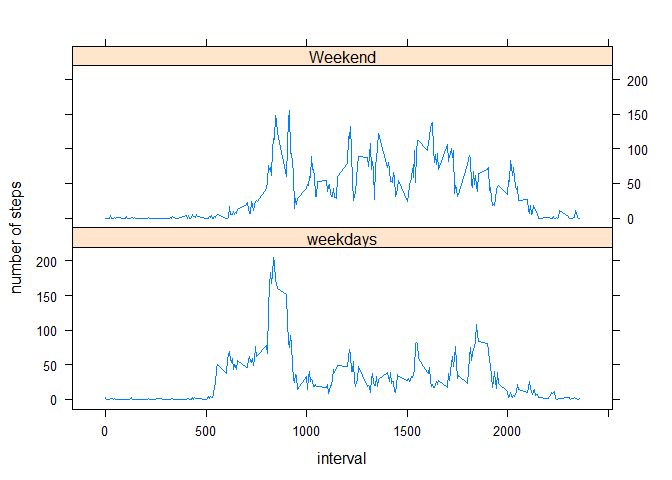

## Loading and preprocessing the data

```r
getwd()
```

```
## [1] "C:/Users/user/Desktop"
```

```r
library(lattice)
activity<-read.csv("activity.csv")
head(activity)
```

```
##   steps       date interval
## 1    NA 2012-10-01        0
## 2    NA 2012-10-01        5
## 3    NA 2012-10-01       10
## 4    NA 2012-10-01       15
## 5    NA 2012-10-01       20
## 6    NA 2012-10-01       25
```

## What is mean total number of steps taken per day?

```r
stepperday<-aggregate(steps~date,data=activity,sum)
hist(stepperday$steps,main="mean total number of steps taken per day",xlab="steps")
```

<!-- -->

```r
daymean=mean(stepperday$steps)
daymedian=median(stepperday$steps)
daymean
```

```
## [1] 10766.19
```

```r
daymedian
```

```
## [1] 10765
```
mean of the total number of steps taken per day is 10766.19

median of the total number of steps taken per day is 10765
## What is the average daily activity pattern?

```r
stepinterval<-aggregate(steps~interval,data=activity, "mean")
plot(stepinterval$interval,stepinterval$steps,type="l",xlab="interval",ylab="steps",main="average daily activity pattern")
```

<!-- -->

```r
a<-which.max(stepinterval$steps)
stepinterval$interval[a]
```

```
## [1] 835
```
interval of 835 contains the maximum number of steps

## Imputing missing values

```r
NAs<-sum(!complete.cases(activity))
NAs
```

```
## [1] 2304
```

total number of missing value in the dataset is 2304.

use median of the day to fill the missing value

```r
stepmedian<-aggregate(steps~interval,data=activity,"median")
Nanew<-numeric()
nrow(activity)
```

```
## [1] 17568
```

```r
for (i in 1:17568){
  a<-activity[i,]
  if (is.na(a$steps)){
    steps<-subset(stepmedian,interval==a$interval)$steps
  }else{
    steps<-a$steps
  }
  Nanew<-c(Nanew,steps)
}
```


```r
activity1<-activity
activity1$steps<-Nanew
sum(!complete.cases(activity1))
```

```
## [1] 0
```

```r
stepperday1<-aggregate(steps~date,data=activity1,sum)
hist(stepperday1$steps,main="mean total number of steps taken per day",xlab="steps")
```

<!-- -->

```r
daymean1=mean(stepperday1$steps)
daymedian1=median(stepperday1$steps)
daymean1
```

```
## [1] 9503.869
```

```r
daymedian1
```

```
## [1] 10395
```

mean total number of steps taken per day is 9503.869
median total number of steps taken per day is 10395
the new value are less than the value before.
the frenquency of steps between 0 and 5000 increase, so the mean and median will decrease.

## Are there differences in activity patterns between weekdays and weekends?

```r
weekdays<-c("Monday","Tuesday","Wednesday","Thursday","Friday")
activity1$week<-as.factor(ifelse(is.element(weekdays(as.Date(activity1$date)),weekdays),"weekdays","Weekend"))
stepsall<-aggregate(steps~interval+week,data=activity1,"mean")
xyplot(stepsall$steps~stepsall$interval|stepsall$week,layout=c(1,2),type="l",xlab="interval",ylab="number of steps")
```

<!-- -->

